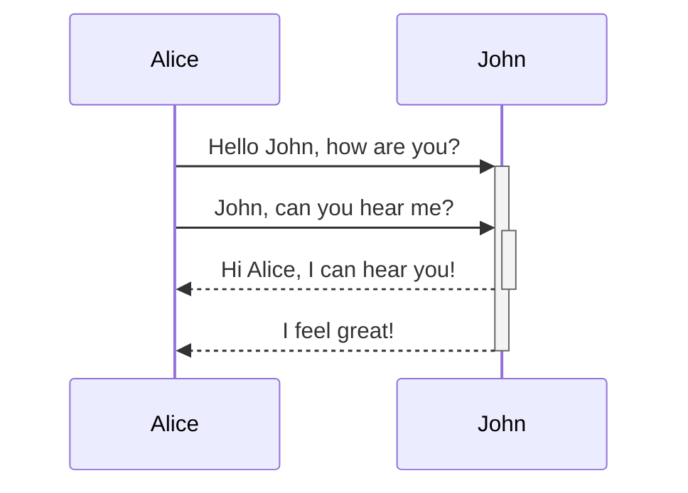

# test20260820

## プロジェクト概要

このプロジェクトでは、天気予報の API を作成します。
API は、[FastAPI](https://fastapi.tiangolo.com/)（Python）フレームワークを使って実装します。

## 必要条件

- Python 3.10 以上
- uv

## セットアップ

```bash
# 依存パッケージのインストール
uv sync
```

## 実行方法

```bash
# 開発サーバーの起動
uv run uvicorn src.main:app --reload
```

サーバー起動後、ブラウザで `http://127.0.0.1:8000` にアクセスすることで API を利用できます。
自動生成された API ドキュメントは `http://127.0.0.1:8000/docs` で確認できます。

## テスト

```bash
# テストの実行
uv run pytest
```


